# Object Detection in an Urban Environment

### GitHub Repository Link
https://github.com/reaganmugonya/Object-Detection-in-an-Urban-Environment.git

## Project overview
This is a computer vision project to detect and classify objects such as cars, pedestrians and cyclists from camera input of a moving vehicle.

### Data
We use the [Waymo Open dataset](https://waymo.com/open/) for this project. The files can be downloaded from  [Google Cloud Bucket](https://console.cloud.google.com/storage/browser/waymo_open_dataset_v_1_2_0_individual_files) as individual tf records.

## Set up
The training, validation and testing should be in the data folder. We could not upload the files to this github. Since we used the Udacity Workspace the .tfrecord were prepared for us and we arranged like
```
/home/workspace/data/
    - train: contained 86 tfrecords
    - val: contained 10 tfrecords
    - test - contained 3 files to test your model and create inference videos
```

The Experiments folder is were files used for training, evaluation, and saved models are stored. However, the large files were not uploaded to github but can me created using the instructions below;

```
/home/workspace/experiments/
    - pretrained_model/
    - exporter_main_v2.py - to create an inference model
    - model_main_tf2.py - to launch training
    - reference/ - reference training with the unchanged config file
    - experiment0/ - contains the pipeline config file with updated augmentation
    - experiment0/ - contains the pipeline config file with updated augmentation
    - label_map.pbtxt
    ...
```

### Editing the config files.
We need to download the pretrained model and move it to 

```
cd /home/workspace/experiments/pretrained_model/

wget http://download.tensorflow.org/models/object_detection/tf2/20200711/ssd_resnet50_v1_fpn_640x640_coco17_tpu-8.tar.gz

tar -xvzf ssd_resnet50_v1_fpn_640x640_coco17_tpu-8.tar.gz

rm -rf ssd_resnet50_v1_fpn_640x640_coco17_tpu-8.tar.gz
```

We need to edit the config files to change the location of the training and validation files, as well as the location of the label_map file, pretrained weights. We also need to adjust the batch size. To do so, run the following:

```
cd /home/workspace/
python edit_config.py --train_dir /home/workspace/data/train/ --eval_dir /home/workspace/data/val/ --batch_size 2 --checkpoint /home/workspace/experiments/pretrained_model/ssd_resnet50_v1_fpn_640x640_coco17_tpu-8/checkpoint/ckpt-0 --label_map /home/workspace/experiments/label_map.pbtxt
```
A new config file called ```pipeline_new.config``` will be created in the ```/home/workspace/ directory```. Move this file to the ```/home/workspace/experiments/reference/``` directory

## Dataset
#### Dataset analysis
This section should contain a quantitative and qualitative description of the dataset. 

##### Images from the dataset
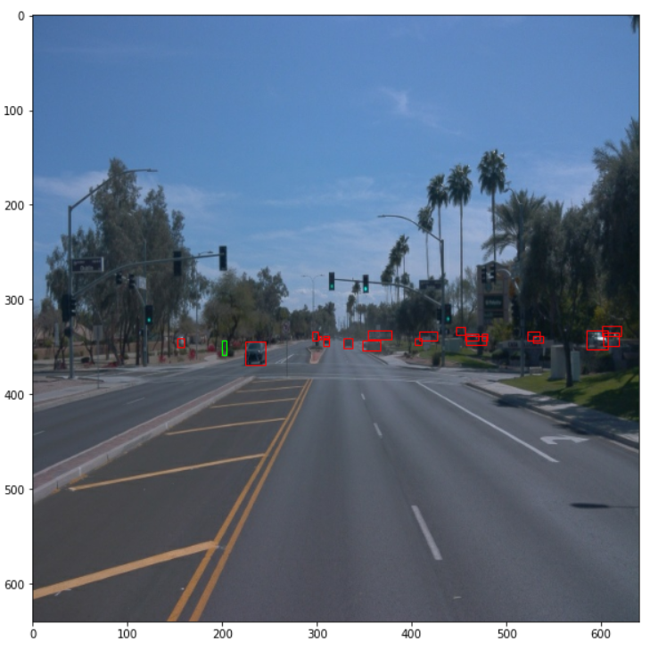
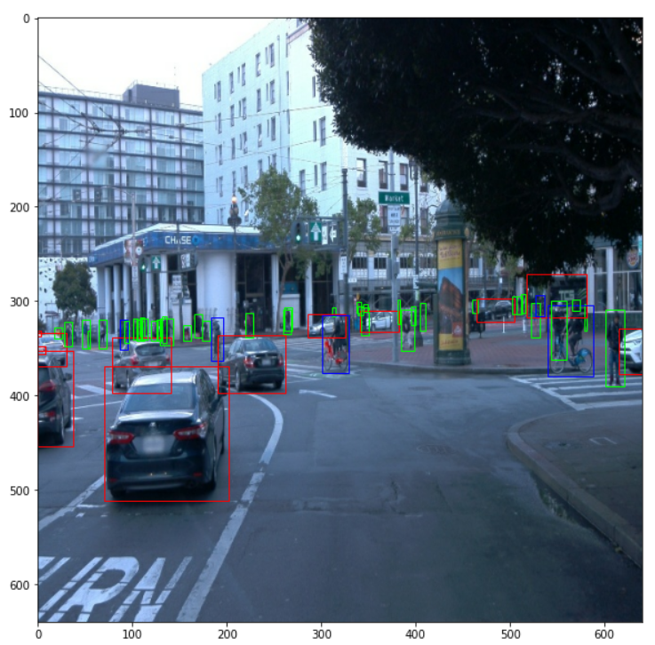
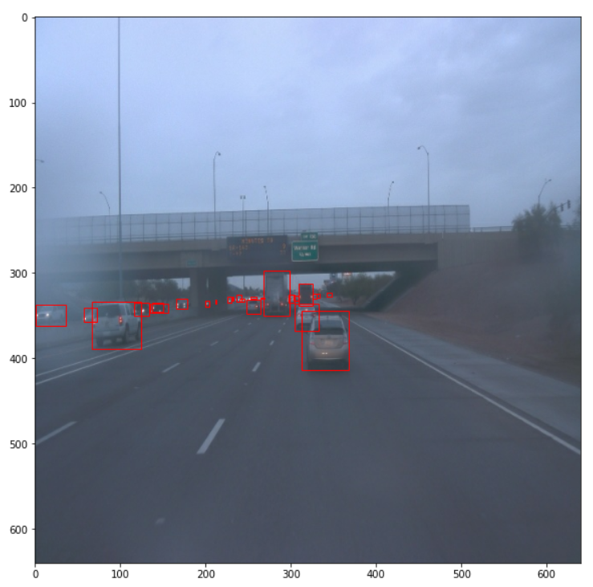
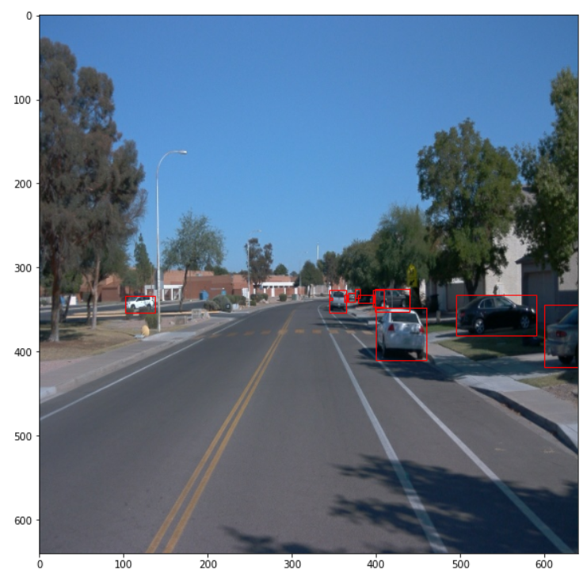
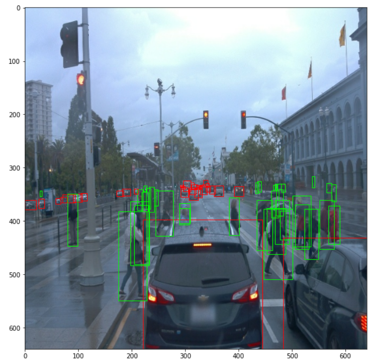

##### Analysis
The dataset has a skewed distribution with a high number of cars, less pedestrians and very few cyclists thus there is a class imbalance problem
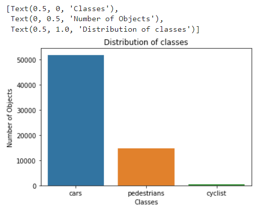

##### Below is the distribution of the classes in the images
Distribution of cars

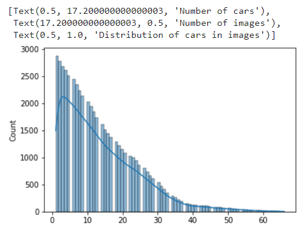

Distribution of Pedestrians


Distribution of Pedestrians

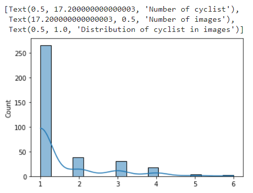

## Training

The hyperparameters for training the model are defined in the pipeline_new.config
### Training process
We run the script below to train. 
Note: The path and model directory has to modified for each training `

```
python experiments/model_main_tf2.py --model_dir=experiments/reference/ --pipeline_config_path=experiments/reference/pipeline_new.config
```
To monitor the training, you can launch a tensorboard instance by running ``` python -m tensorboard.main --logdir experiments/reference/ ```

### Evaluation process
We run the script below to evaluate the model. 
Note: The path and model directory has to modified for each evaluation

```
python experiments/model_main_tf2.py --model_dir=experiments/reference/ --pipeline_config_path=experiments/reference/pipeline_new.config --checkpoint_dir=experiments/reference/
```
### validation loss 
With the initial model from The residual network. The error and the loss is high thus the model does not perform so well.

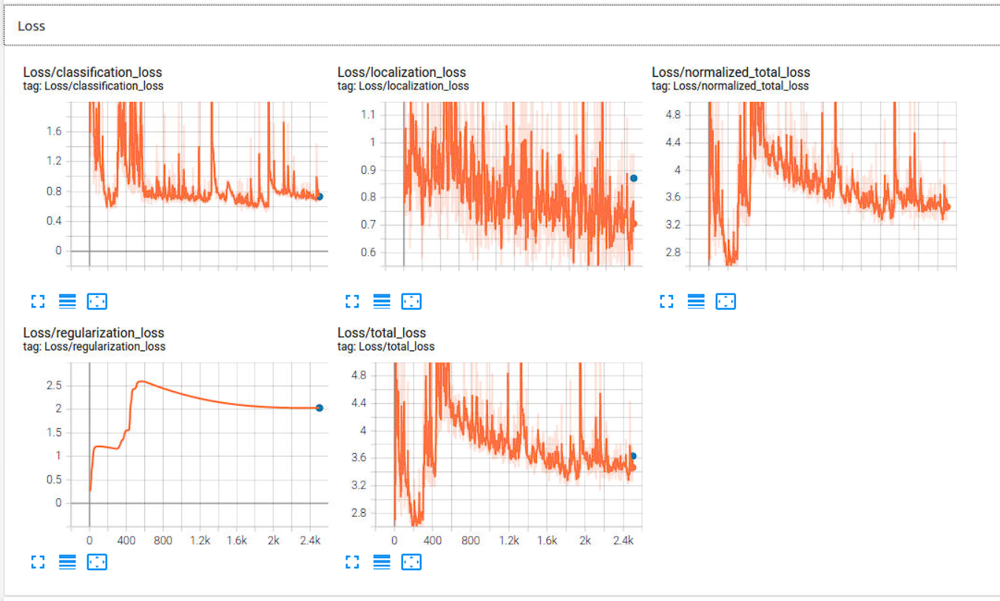

### Precision and recall loss 
With the initial model from The residual network. The precision and recall are low  

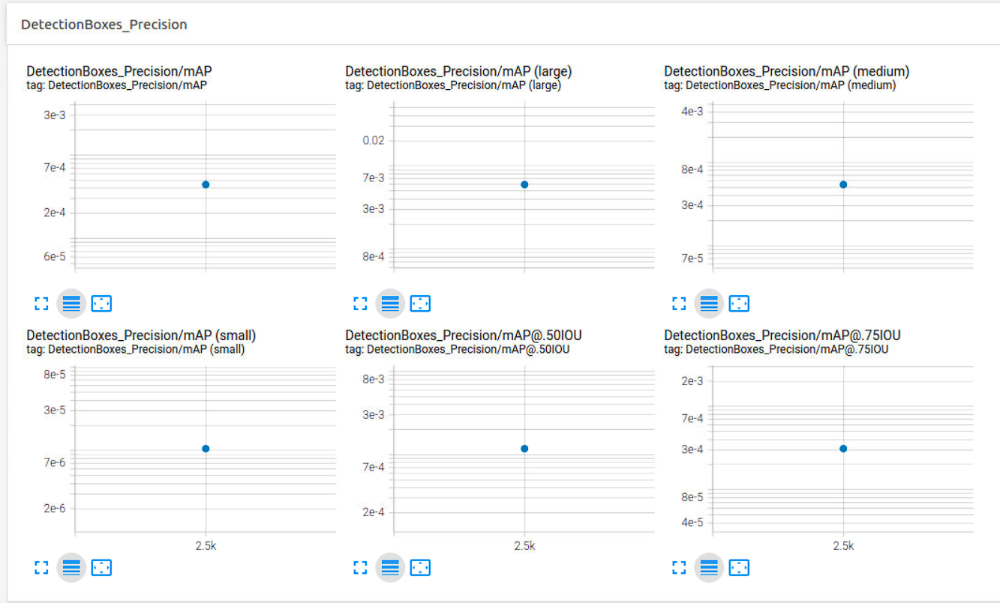
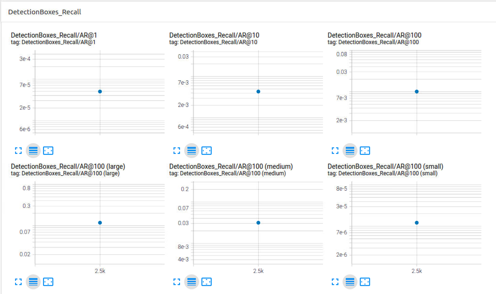

## Improve on the reference
To improve the Model we used various augmentations such as: 
The augmentations can be found in the ``` /home/workspace/experiments/experiment1/pipeline_new.config ```

- rgb_to_gray by probability: 0.2
- brightness adjusted to max_delt 0.2
- contrast adjusted to max_delt 0.2
- hue adjusted to max_delt 0.2
- saturation adjusted to max_delt 0.8 and max_delta: 1.25

#### Images created after Augmentations

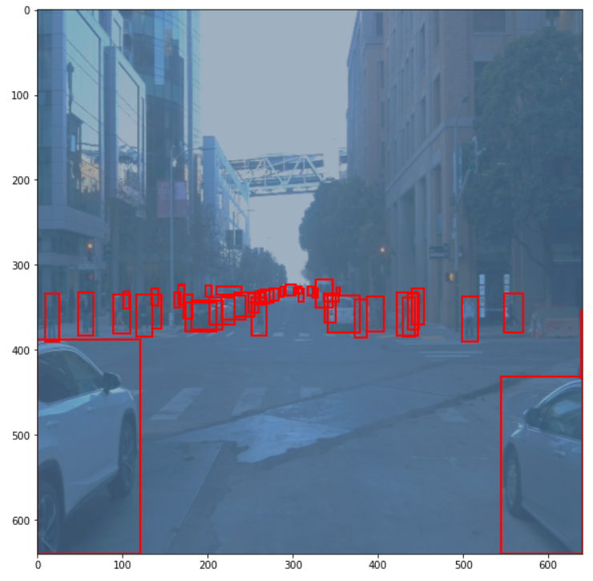
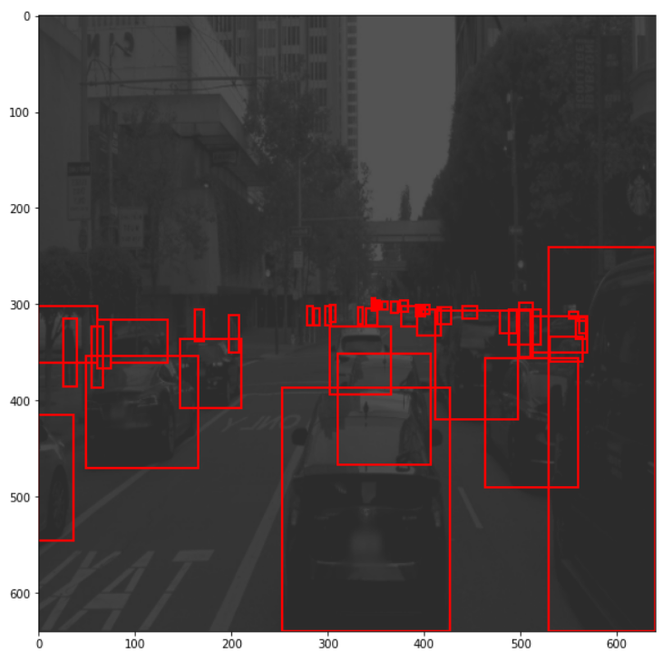
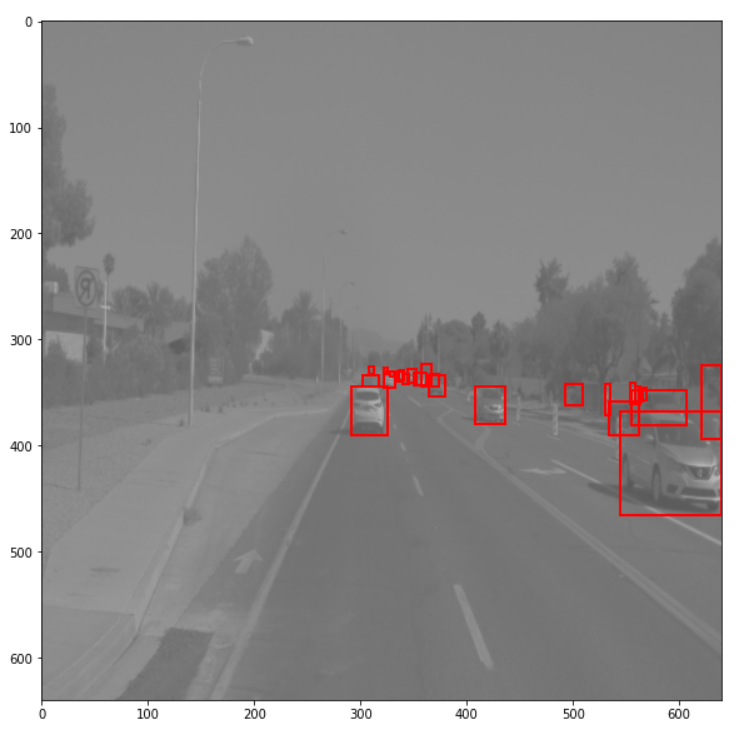
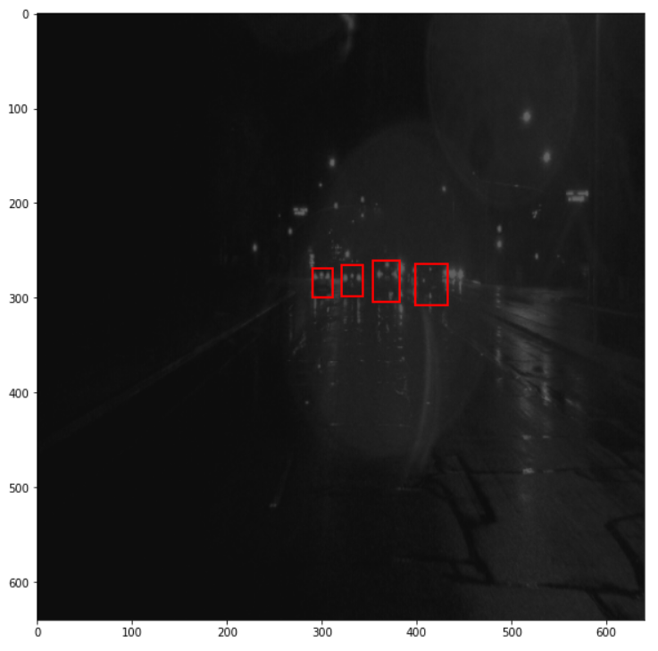
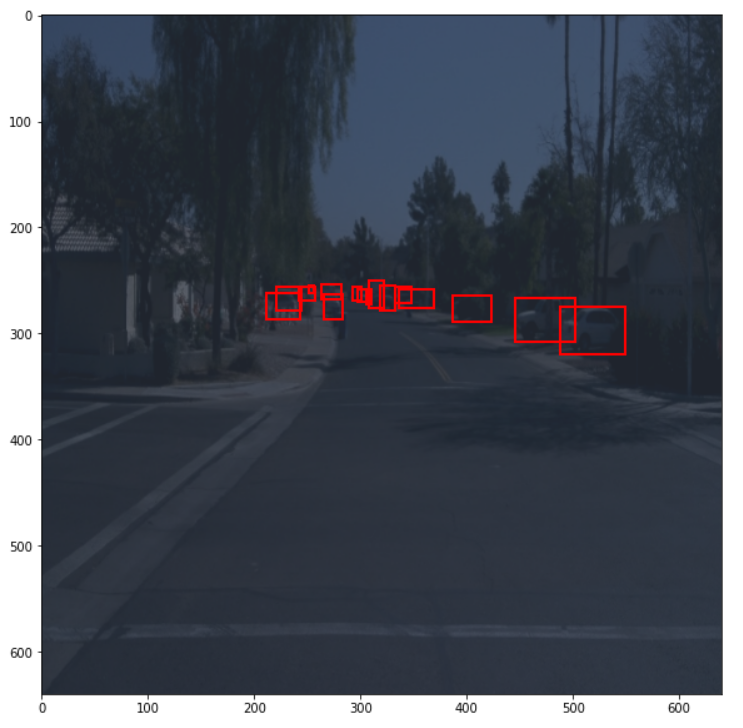
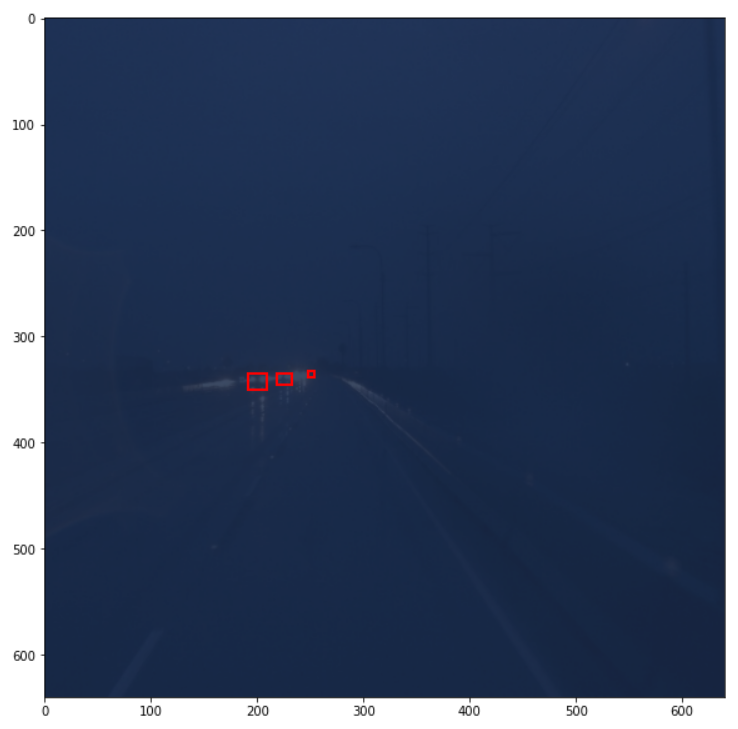


### validation loss 
After adding the avarious augmentations to the model, the error and the loss is reduces thus improved performance of the model.

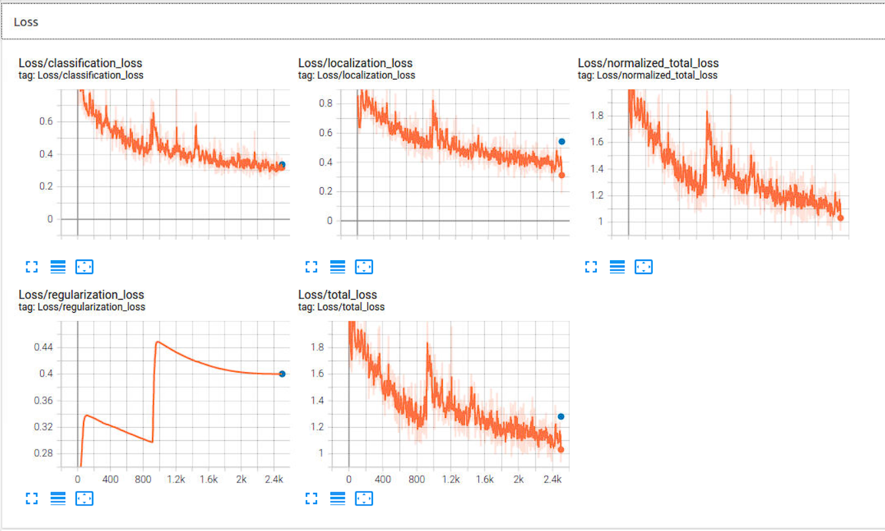

### Precision and recall loss 
After adding the avarious augmentations to the model, the Precision and recall increases

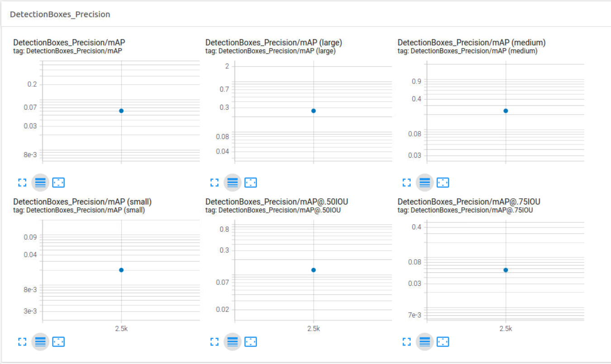
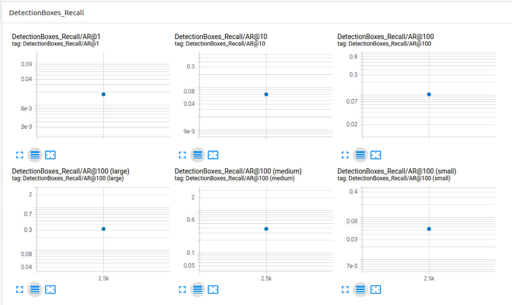

## Creating an animation
### Export the trained model
Modify the arguments of the following function to adjust it to your models:

```
python experiments/exporter_main_v2.py --input_type image_tensor --pipeline_config_path experiments/reference/pipeline_new.config --trained_checkpoint_dir experiments/reference/ --output_directory experiments/reference/exported/ 
```

Create a video of your model's inferences for any tf record file. To do so, run the following command (modify it to your files):
```
python inference_video.py --labelmap_path label_map.pbtxt --model_path experiments/reference/exported/saved_model --tf_record_path data/test/segment-12200383401366682847_2552_140_2572_140_with_camera_labels.tfrecord --config_path experiments/reference/pipeline_new.config --output_path animation.gif
```
