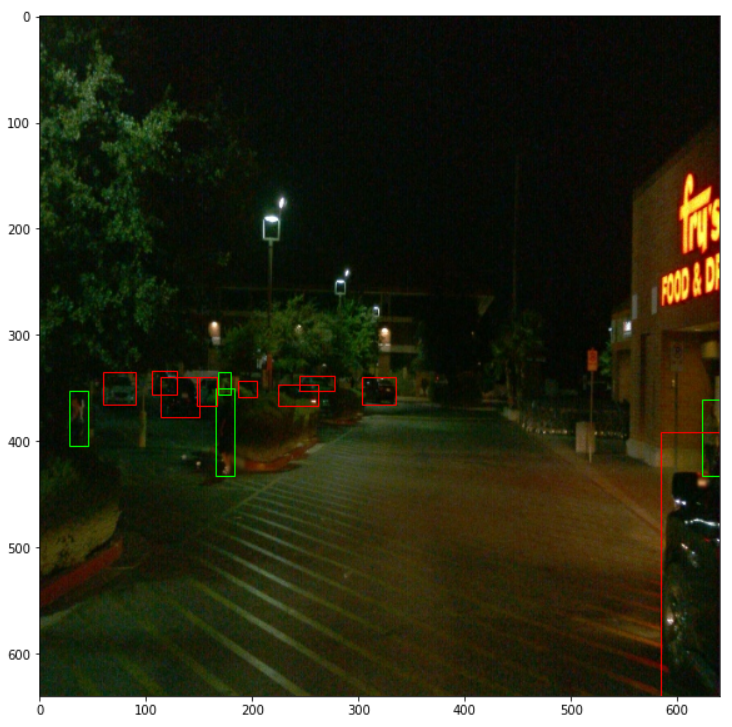
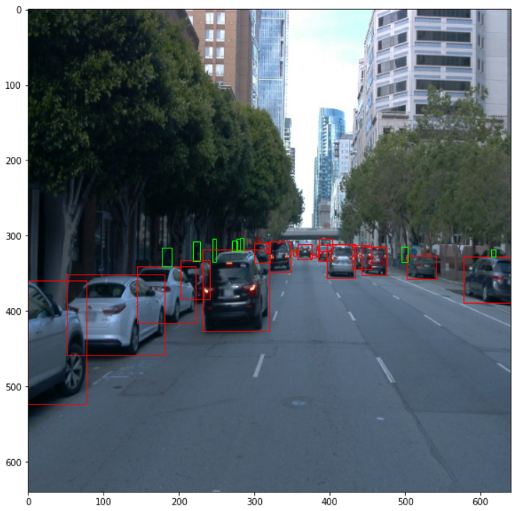
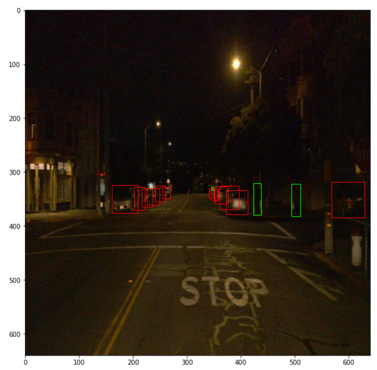
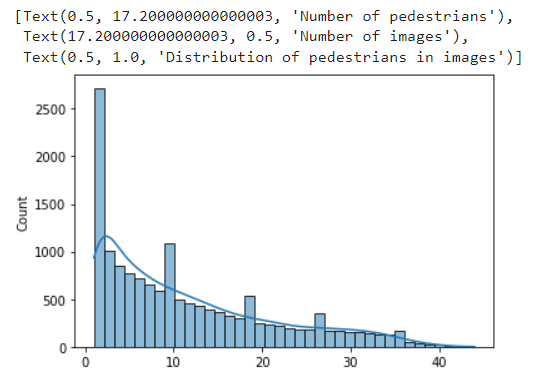

# Object Detection in an Urban Environment

### GitHub Repository Link
https://github.com/reaganmugonya/Object-Detection-in-an-Urban-Environment.git

## Project overview
This is a computer vision project to detect and classify objects such as cars, pedestrians and cyclists from camera input of a moving vehicle.

### Data
We use the [Waymo Open dataset](https://waymo.com/open/) for this project. The files can be downloaded from  [Google Cloud Bucket](https://console.cloud.google.com/storage/browser/waymo_open_dataset_v_1_2_0_individual_files) as individual tf records.

## Set up
The training, validation and testing should be in the data folder. We could not upload the files to this github. Since we used the Udacity Workspace the .tfrecord were prepared for us and we arranged like
```
/home/workspace/data/
    - train: contained 86 tfrecords
    - val: contained 10 tfrecords
    - test - contained 3 files to test your model and create inference videos
```

The Experiments folder is were files used for training, evaluation, and saved models are stored. However, the large files were not uploaded to github but can me created using the instructions below;

```
/home/workspace/experiments/
    - pretrained_model/
    - exporter_main_v2.py - to create an inference model
    - model_main_tf2.py - to launch training
    - reference/ - reference training with the unchanged config file
    - experiment0/ - contains the final config file
    - label_map.pbtxt
    ...
```

### Editing the config files.
We need to download the pretrained model and move it to 

```
cd /home/workspace/experiments/pretrained_model/

wget http://download.tensorflow.org/models/object_detection/tf2/20200711/ssd_resnet50_v1_fpn_640x640_coco17_tpu-8.tar.gz

tar -xvzf ssd_resnet50_v1_fpn_640x640_coco17_tpu-8.tar.gz

rm -rf ssd_resnet50_v1_fpn_640x640_coco17_tpu-8.tar.gz
```

We need to edit the config files to change the location of the training and validation files, as well as the location of the label_map file, pretrained weights. We also need to adjust the batch size. To do so, run the following:

```
cd /home/workspace/
python edit_config.py --train_dir /home/workspace/data/train/ --eval_dir /home/workspace/data/val/ --batch_size 2 --checkpoint /home/workspace/experiments/pretrained_model/ssd_resnet50_v1_fpn_640x640_coco17_tpu-8/checkpoint/ckpt-0 --label_map /home/workspace/experiments/label_map.pbtxt
```
A new config file called ```pipeline_new.config``` will be created in the ```/home/workspace/ directory```. Move this file to the ```/home/workspace/experiments/reference/``` directory

## Dataset
#### Dataset analysis
This section should contain a quantitative and qualitative description of the dataset. 

##### Images from the dataset
|   |   |
|   |   |
|   |   |
|   |   |

##### Analysis
The dataset has a skewed distribution with a high number of cars, less pedestrians and very few cyclists thus there is a class imbalance problem


##### Below is the distribution of the classes in the images
Distribution of cars


Distribution of Pedestrians



Distribution of Pedestrians


## Training

The hyperparameters for training the model are defined in the pipeline_new.config
### Training process
We run the script below to train. 
```
python experiments/model_main_tf2.py --model_dir=experiments/experiment0/ --pipeline_config_path=experiments/experiment0/pipeline_new.config
```
To monitor the training, you can launch a tensorboard instance by running ```python -m tensorboard.main --logdir experiments/experiment0/```

### Evaluation process
We run the script below to evaluate the model. 
```
python experiments/model_main_tf2.py --model_dir=experiments/experiment0/ --pipeline_config_path=experiments/experiment0/pipeline_new.config --checkpoint_dir=experiments/experiment0/
```
### validation loss 
Images from the losss after training the 

### Precision and recall loss 
Images from the losss after training the

### Improve on the reference
To improve the Model we used various augementations such as:

